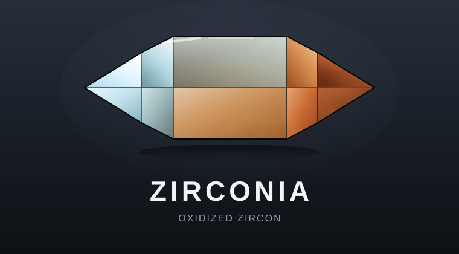

<p align="center">
  
</p>

<p align="center">
  <a href="https://github.com/rcore-os/zCore/actions"></a>
  <a href="https://andrewdavidmackenzie.github.io/zCore/"></a>
  <a href="https://coveralls.io/github/rcore-os/zCore?branch=master"></a>
  <a href="https://github.com/rcore-os/zCore/issues"></a>
  <a href="https://github.com/rcore-os/zCore/fork"></a>
  
  
</p>

An OS kernel based on Zircon with Linux compatibility.

## Quick start

```bash
make linux-run
```

This builds and boots zCore on QEMU (aarch64) with a minimal Linux
emulation layer and a BusyBox shell. Simple commands like `echo` and
`uname` work. Many others will fail because the underlying Linux syscall
implementations are incomplete. See the warnings printed at boot for
examples of unimplemented syscalls.

Type `poweroff -f` at the `/ #` prompt (or press `Ctrl-A X`) to exit.

Prerequisites: Rust nightly, QEMU, and `aarch64-linux-musl-gcc`
(on macOS: `make config` installs the cross-compiler via Homebrew).

## Building

All build commands are target-driven. Each target is defined in a TOML
file under `targets/` that specifies the architecture, drivers, features,
and whether to include Linux emulation. You never need to specify
feature flags manually.

### Available targets

| Target | Arch | Flavour | Hardware |
|--------|------|-------------|----------|
| `qemu-aarch64` | aarch64 | linux | QEMU virt |
| `qemu-x86_64` | x86_64 | linux | QEMU q35 |
| `qemu-riscv64` | riscv64 | linux | QEMU virt |
| `raspi400` | aarch64 | Zircon only | Raspberry Pi 400 |
| `x86-laptop` | x86_64 | Zircon only | x86_64 real hardware (UEFI) |
| `libos` | host | linux | runs as a host process |

### Build commands

```bash
# Build a kernel (features come from targets/<name>.toml)
cargo zcore-build -m qemu-aarch64
cargo zcore-build -m raspi400
cargo zcore-build -m libos

# Override the default flavour
cargo zcore-build -m qemu-aarch64

# Build and strip to raw binary
cargo bin -m qemu-aarch64

# Build and run in QEMU
cargo qemu -m qemu-aarch64
cargo qemu -m qemu-x86_64 --log info

# Build and run as a host process (no QEMU needed)
cargo zcore-build -m libos                         # linux (default flavour)
cargo zcore-build -m libos     # Zircon only
cargo linux-libos --args "/bin/busybox ls"          # build + run linux libos
```

### Makefile shortcuts

| Scope           | Linux                      | Zircon                         |
|-----------------|----------------------------|--------------------------------|
| QEMU (any arch) | `make linux-run`           | `make zircon-run`              |
| x86_64 specific | `make x86-linux-build/run` | `make x86-zircon-build/run`    |
| LibOS build     | `make libos-build-linux`   | `make libos-build-zircon`      |
| LibOS run       | `make libos-run-linux`     | `make libos-run-zircon` (#281) |
| Pi 400          | n/a (Zircon only)          | `make raspi400-build/run/sd`   |

```bash
make raspi400-sd SD=/Volumes/boot   # flash SD card for Pi 400
make clippy-all              # clippy on all code (all archs, libos, userspace, tests)
make test                    # boot smoke test + libc conformance tests
```

### Target configuration

Each `targets/<name>.toml` file is the single source of truth:

```toml
# targets/qemu-aarch64.toml
default-flavour = "linux"
arch = "aarch64"
linker-script = "zCore/kernel/src/platform/aarch64/linker.ld"
drivers = ["pl011-uart", "gic-400", "virtio-blk"]

[qemu]
machine = "virt"
cpu = "cortex-a72"
memory = "2G"

[rustc-target]
llvm-target = "aarch64-unknown-linux-gnu"
# ...
```

The `drivers` list maps to cargo feature flags in `kernel-drivers`.
The `default-flavour` sets whether the kernel boots with Linux
syscall emulation or the Zircon microkernel flavour.

## Attribution and History

This project is a fork of [rcore-os/zCore](https://github.com/rcore-os/zCore),
originally created by **Runji Wang** and the
[rCore-OS community](https://github.com/rcore-os) at Tsinghua University.
The original project reimplements Google's Zircon microkernel in safe Rust,
with a Linux syscall compatibility layer.

### Key contributors to the original project

- **Runji Wang** ([@wangrunji0408](https://github.com/wrj)) -- creator and
  primary architect of the Zircon object model, HAL abstraction, and Linux
  syscall layer.
- **Yuekai Jia** ([@equation314](https://github.com/equation314)) -- x86_64
  platform support, UEFI boot, VirtIO drivers.
- **Chenyuan Yang** -- riscv64 platform port, SBI boot.

### This fork

This fork (maintained by [@andrewdavidmackenzie](https://github.com/andrewdavidmackenzie))
focuses on:
- aarch64 bare-metal (QEMU virt, Raspberry Pi 400)
- Linux syscall completeness (libc-test pass rate: 44/69 = 63%)
- Code quality (English comments, modern Rust idioms, CI coverage)
- Zircon flavour via the petal userspace toolkit

See [CHANGELOG](docs/) and the [issue tracker](https://github.com/andrewdavidmackenzie/zCore/issues)
for current development activity.

## 目录

- [启动内核](#启动内核)
- [项目构建](#项目构建)
  - [构建命令](#构建命令)
  - [命令参考](#命令参考)
- [平台支持](#平台支持)
  - [Qemu/virt](#qemuvirt)
  - [全志/哪吒](#全志哪吒)
  - [赛昉/星光](#赛昉星光)
  - [晶视/cr1825](#晶视cr1825)

## 项目构建

项目构建采用 [xtask 模式](https://github.com/matklad/cargo-xtask)，常用操作被封装成 cargo 命令。

另外，还通过 [Makefile](Makefile) 提供 make 调用，以兼容一些旧脚本。

目前已测试的开发环境包括 Ubuntu20.04、Ubuntu22.04 和 Debian11，Ubuntu22.04 不能正确编译 x86_64 的 libc 测试。若不需要烧写到物理硬件，使用 WSL2 或其他虚拟机的操作与真机并无不同之处。

### 构建命令

命令的基本格式为 `cargo <command> [--args [value]]`，这实际上是 `cargo run --package xtask --release -- <command> [--args [value]]` 的简写。`command` 被传递给 xtask 应用程序，解析并执行。

许多命令的效果受到仓库环境的影响，也会影响仓库的环境。为了使用方便，如果一个命令依赖于另一个命令的效果，它们被设计为递归的。命令的递归关系图如下，对于它们的详细解释在下一节：

---

> **NOTICE** 建议使用等宽字体

---

```text
┌────────────┐ ┌─────────────┐ ┌─────────────┐
| update-all | | check-style | |
└────────────┘ └─────────────┘ └─────────────┘
┌─────┐ ┌──────┐  ┌─────┐  ┌─────────────┐ ┌─────────────────┐
| asm | | qemu |─→| bin |  | linux-libos | | libos-libc-test |
└─────┘ └──────┘  └─────┘  └─────────────┘ └─────────────────┘
                     |            └───┐┌─────┘   ┌───────────┐
                     ↓                ↓↓      ┌──| libc-test |
                 ┌───────┐        ┌────────┐←─┘  └───────────┘
                 | image |───────→| rootfs |←─┐ ┌────────────┐
                 └───────┘        └────────┘  └─| other-test |
                 ┌────────┐           ↑         └────────────┘
                 | opencv |────→┌───────────┐
                 └────────┘  ┌─→| musl-libc |
                 ┌────────┐  |  └───────────┘
                 | ffmpeg |──┘
                 └────────┘
-------------------------------------------------------------------
图例：A 递归执行 B（A 依赖 B 的结果，执行 A 时自动先执行 B）
┌───┐  ┌───┐
| A |─→| B |
└───┘  └───┘
```

### 命令参考

如果下面的命令描述与行为不符，或怀疑此文档更新不及时，亦可直接查看[内联文档](xtask/src/main.rs#L48)。
如果发现 `error: no such subcommand: ...`，查看[命令简写](.cargo/config.toml)为哪些命令设置了别名。

---

> **NOTICE** 内联文档也是中英双语

---

#### **update-all**

更新工具链、依赖和 git 子模块。

如果没有递归克隆子模块，可以使用这个命令克隆。

```bash
cargo update-all
```

#### **check-style**

静态检查。设置多种编译选项，检查代码能否编译。

```bash
cargo check-style
```

#### **asm**

反汇并保存编指定架构的内核。默认保存到 `target/zcore.asm`。

```bash
cargo asm -m virt-riscv64 -o z.asm
```

#### **bin**

生成内核 raw 镜像到指定位置。默认输出到 `target/{arch}/release/zcore.bin`。

```bash
cargo bin -m virt-riscv64 -o z.bin
```

#### **qemu**

在 Qemu 中启动 zCore。这需要 Qemu 已经安装好了。

```bash
cargo qemu --arch riscv64 --smp 4
```

支持将 qemu 连接到 gdb：

```bash
cargo qemu --arch riscv64 --smp 4 --gdb 1234
```

#### **rootfs**

重建 Linux rootfs。直接执行这个命令会清空已有的为此架构构造的 rootfs 目录，重建最小的 rootfs。

```bash
cargo rootfs --arch riscv64
```

#### **musl-libs**

将 musl 动态库拷贝到 rootfs 目录对应位置。

```bash
cargo musl-libs --arch riscv64
```

#### **ffmpeg**

将 ffmpeg 动态库拷贝到 rootfs 目录对应位置。

```bash
cargo ffmpeg --arch riscv64
```

#### **opencv**

将 opencv 动态库拷贝到 rootfs 目录对应位置。如果 ffmpeg 已经放好了，opencv 将会编译出包含 ffmepg 支持的版本。

```bash
cargo opencv --arch riscv64
```

#### **libc-test**

将 libc 测试集拷贝到 rootfs 目录对应位置。

```bash
cargo libc-test --arch riscv64
```

#### **other-test**

将其他测试集拷贝到 rootfs 目录对应位置。

```bash
cargo other-test --arch riscv64
```

#### **image**

从 rootfs 目录构建 Linux rootfs 镜像文件。

```bash
cargo image --arch riscv64
```

#### **linux-libos**

在 linux libos 模式下启动 zCore 并执行位于指定路径的应用程序。

> **NOTICE** libos 模式只能执行单个应用程序，完成就会退出。

```bash
cargo linux-libos --args "/bin/busybox"
```

可以直接给应用程序传参数：

```bash
cargo linux-libos --args "/bin/busybox ls"
```

## 平台支持

### Qemu/virt

直接使用命令启动，参见[启动内核](#启动内核)和 [`qemu` 命令](#qemu)。

### 全志/哪吒

使用以下命令构造系统镜像：

```bash
cargo bin -m nezha -o z.bin
```

然后使用 [rustsbi-d1](https://github.com/rustsbi/rustsbi-d1) 将镜像部署到 Flash 或 DRAM。

另: 可以查看[README for D1 文档](docs/README-D1.md)获知更多D1开发板有关的操作指导。

### 赛昉/星光

使用以下命令构造系统镜像：

```bash
cargo bin -m visionfive -o z.bin
```

然后根据[此文档](docs/README-visionfive.md)的详细说明通过 u-boot 网络启动系统。

### 晶视/cr1825

使用以下命令构造系统镜像：

```bash
cargo bin -m cr1825 -o z.bin
```

然后通过 u-boot 网络启动系统。

## 其他

- [An English README](docs/README_EN.md)
- [开发者注意事项（草案）](docs/for-developers.md)
- [构建系统更新日志](xtask/CHANGELOG.md)
